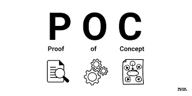

# 📖 O Catálogo

## Sobre

**Bem-vindo ao "Catálogo de Boas Práticas para o Desenvolvimento e Implantação de Microsserviços"**, uma referência compreensiva destinada a arquitetos de software, desenvolvedores, estudantes de tecnologia da informação e gestores técnicos que buscam excelência na construção de sistemas escaláveis e robustos. Este guia é uma fonte essencial de conhecimento e orientação prática, projetado para demonstrar através de Provas de Conceito (POCs) as melhores práticas na arquitetura de microsserviços.

<figure><figcaption></figcaption></figure>

